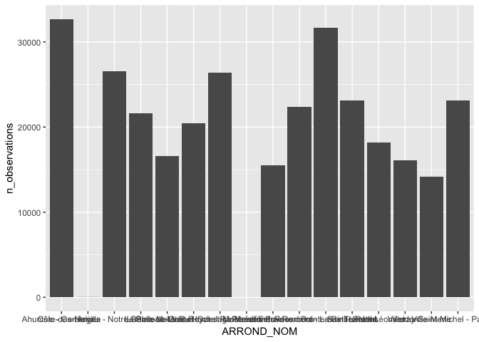

## Packages et importation des données


```r
#Loading packages
library(tidyverse)
# Import data set
arbres_dataframe  = read_csv("arbres_publics.csv")
```

## Spécification du bon type de variable pour chaque colonne


```r
arbres_dataframe$EMP_NO %>%  as.character()
arbres_dataframe$ARROND %>% as.character()
arbres_dataframe$No_civique %>% as.integer()
```

## Dans quel arrondissment de montréal y a-t-il le plus d'arbes répertoriés ?
 

```r
arbres_dataframe %>%
  group_by(ARROND_NOM) %>%
  summarise(n_observations = n()) %>%
  arrange(desc(n_observations)) %>%
  ggplot(aes(x = ARROND_NOM, y = n_observations)) + 
    geom_bar(stat="identity")
```

<!-- -->


