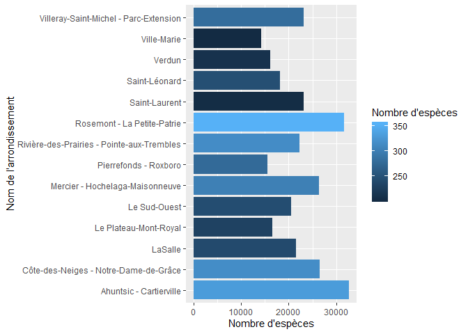

## Packages et importation des données


```r
#Loading packages
library(tidyverse)
# Import data set
arbres_dataframe  = read_csv("arbres_publics.csv")
```

## Spécification du bon type de variable pour chaque colonne


```r
# Ajout d'un 0 devant les numéros d'arrond. inférieur à 10.(convertie automatiquement en chr)
arbres_dataframe$ARROND[which(arbres_dataframe$ARROND<10)] = paste("0", arbres_dataframe$ARROND[which(arbres_dataframe$ARROND<10)], sep ="")
# Type de variable
arbres_dataframe$EMP_NO = arbres_dataframe$EMP_NO %>%  as.character()
arbres_dataframe$No_civique = arbres_dataframe$No_civique %>% as.integer()
```

# Exploration du data set

## Combien d'espèces différentes d'arbres sont répertoriés ?


```r
# Nombre d'espèces répertoriées avec le nom latin
  n_distinct(arbres_dataframe$Essence_latin, na.rm = TRUE)
```

```
## [1] 615
```

```r
# Nombre d'espèces répertoriées avec le nom Français
  n_distinct(arbres_dataframe$Essence_fr, na.rm = TRUE)
```

```
## [1] 610
```

```r
# Nombre d'espèces répertoriées avec le nom Anglais
  n_distinct(arbres_dataframe$ESSENCE_ANG, na.rm = TRUE)
```

```
## [1] 609
```
Le nombre d'espèces changent avec la langue utilisée pour les identifier... Nous allons donc utiliser le nom latin pour la suite.

# Nombre d'arbes répertoriés pour chaque arrondissement.


```r
arbres_dataframe %>%
# Regroupement par arrondissement
  group_by(ARROND_NOM) %>%
# Nombre d'observations
  summarise(n_observations = n()) %>%
# Ordre dédroissant
  arrange(desc(n_observations)) 
```

```
## # A tibble: 16 x 2
##    ARROND_NOM                                 n_observations
##    <chr>                                               <int>
##  1 Ahuntsic - Cartierville                             32677
##  2 Rosemont - La Petite-Patrie                         31683
##  3 Côte-des-Neiges - Notre-Dame-de-Grâce               26551
##  4 Mercier - Hochelaga-Maisonneuve                     26368
##  5 Villeray-Saint-Michel - Parc-Extension              23119
##  6 Saint-Laurent                                       23094
##  7 Rivière-des-Prairies - Pointe-aux-Trembles          22335
##  8 LaSalle                                             21579
##  9 Le Sud-Ouest                                        20457
## 10 Saint-Léonard                                       18217
## 11 Le Plateau-Mont-Royal                               16556
## 12 Verdun                                              16106
## 13 Pierrefonds - Roxboro                               15527
## 14 Ville-Marie                                         14193
## 15 Anjou                                                  17
## 16 Montréal-Est                                            5
```
L'arrondissement où il y a le plus grand nombre d'abres répertoriés est Ahuntsic-Cartierville.

# Nettoyage des données
Il y a très peu d'arbres répertoriés pour certain arrondissement (< 18 pour Anjou et Montréal-Est). J'ai choisi de les retirer de l'analyse.


```r
arbres_dataframe %>%
# Sélection des lignes où le nom d'arrondissement n'est pas Anjou ou Montréal-Est
  filter(ARROND_NOM != "Anjou" & ARROND_NOM != "Montréal-Est") %>% 
  group_by(ARROND_NOM) %>%
  summarise(n_observations = n()) %>% 
  arrange(desc(n_observations))
```

# Dans quels arrondissement y a-t-il la plus grande diversitée ?

## Nombre d'espèces

```r
arbres_dataframe %>%
  filter(ARROND_NOM != "Anjou" & ARROND_NOM != "Montréal-Est") %>% 
  group_by(ARROND_NOM) %>%
  summarise(n_observations = n(), n_especes = n_distinct(Essence_latin, na.rm = TRUE)) %>%
  arrange(desc(n_especes)) 
```

```
## # A tibble: 14 x 3
##    ARROND_NOM                                 n_observations n_especes
##    <chr>                                               <int>     <int>
##  1 Rosemont - La Petite-Patrie                         31683       353
##  2 Ahuntsic - Cartierville                             32677       331
##  3 Côte-des-Neiges - Notre-Dame-de-Grâce               26551       316
##  4 Rivière-des-Prairies - Pointe-aux-Trembles          22335       315
##  5 Mercier - Hochelaga-Maisonneuve                     26368       302
##  6 Villeray-Saint-Michel - Parc-Extension              23119       281
##  7 Pierrefonds - Roxboro                               15527       278
##  8 Saint-Léonard                                       18217       247
##  9 Le Sud-Ouest                                        20457       245
## 10 LaSalle                                             21579       241
## 11 Le Plateau-Mont-Royal                               16556       232
## 12 Verdun                                              16106       212
## 13 Saint-Laurent                                       23094       205
## 14 Ville-Marie                                         14193       203
```

## Graphique montrant la diversité d'arbres par arrondissement


```r
# J'ai décidé d'utiliser le numéro d'arrondissement ici pour alléger le graphique (la variable ARROND au lieu de ARROND_NOM)
arbres_dataframe %>% 
  group_by(ARROND) %>%
  summarise(n_observations = n(), n_especes = n_distinct(Essence_latin, na.rm = TRUE)) %>%
# J'ai ainsi mis le filtre sur le nombre d'observations pour exclures les deux même arrondissements, ça allège le code en même temps.
  filter(n_observations > 18) %>%
  ggplot(aes(x = ARROND, y = n_observations, fill = n_especes)) +
  geom_bar(stat = "identity")
```

<!-- -->

### Correspondance entre les numéros d'arrondissement et leur nom.


```r
# Il faudrait utiliser l'information ci dessou et le mettre en légende dans le graphique.
arbres_dataframe %>%
  group_by(ARROND, ARROND_NOM) %>%
  filter(ARROND_NOM != "Anjou" & ARROND_NOM != "Montréal-Est") %>% 
  summarise()
```

```
## # A tibble: 14 x 2
## # Groups:   ARROND [14]
##    ARROND ARROND_NOM                                
##    <chr>  <chr>                                     
##  1 01     Ahuntsic - Cartierville                   
##  2 02     Villeray-Saint-Michel - Parc-Extension    
##  3 03     Rosemont - La Petite-Patrie               
##  4 04     Mercier - Hochelaga-Maisonneuve           
##  5 05     Le Plateau-Mont-Royal                     
##  6 06     Ville-Marie                               
##  7 07     Côte-des-Neiges - Notre-Dame-de-Grâce     
##  8 08     Le Sud-Ouest                              
##  9 09     Rivière-des-Prairies - Pointe-aux-Trembles
## 10 12     Saint-Léonard                             
## 11 13     LaSalle                                   
## 12 16     Verdun                                    
## 13 25     Pierrefonds - Roxboro                     
## 14 27     Saint-Laurent
```


